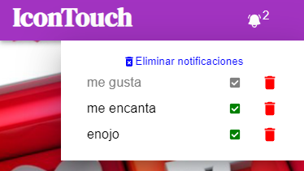

# IconTouch

Esta app [IconTouch](https://icontouch.netlify.app) permite reacionar mediante iconos, y que las notificaciones se muestren en pantalla.Las mismas quedan guardadas en Local Storage lo que permite recargar o cerrar la app y al volver a abrirla perduren.

## La vista segun el tamaño:

Modo celular:

Modo desktop:

## Navbar

Esta compuesto por el nombre de la app y la campanita que muestra la cantidad de nuevas notificaciones.

## Funcionamiento:

- Para comenzar presionar algunos de los iconos

- Apareceran las nuevas notificaciones detalladas en el contenedor que se despliega al hacer click en la campanita.

- Cada notificacion posee un icono para ser eliminada, y otro para marcarla como vista.

- Al marcar como vista el numero de notificaciones en la campanita disminuye.

- Si se toca el icono de eliminar una notificación, esta se borrará del contenedor y la campanita tambien disminuirá.También posee la opción de eliminar todas las notificaciones y que el contenedor quede vacio.

Contenedor de notificaciones vacio

## Construido Con

Las tecnologías que utilicé para construir este proyecto:

- React
- Material-UI (MUI)
- Local Storage

## Autor

- ** MELIE GALAZ **
- ** PAULA GONZALEZ **
- ** SOFIA DE ALESSANDRE **

## Link para usar la app

https://icontouch.netlify.app
